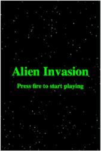

## Purpose

- Working through the GitHub Learning Lab "Create a release based workflow" course to learn the basics to building a project board to manage releases and manage branches to make changes as the application is created. 
- Learn to also resolve bugs after a release and merge any pull requests when managing collaborative projects

Game built through this lab

[Github Repository created through the tutorial](https://github.com/Jiah-design/release-based-workflow)

